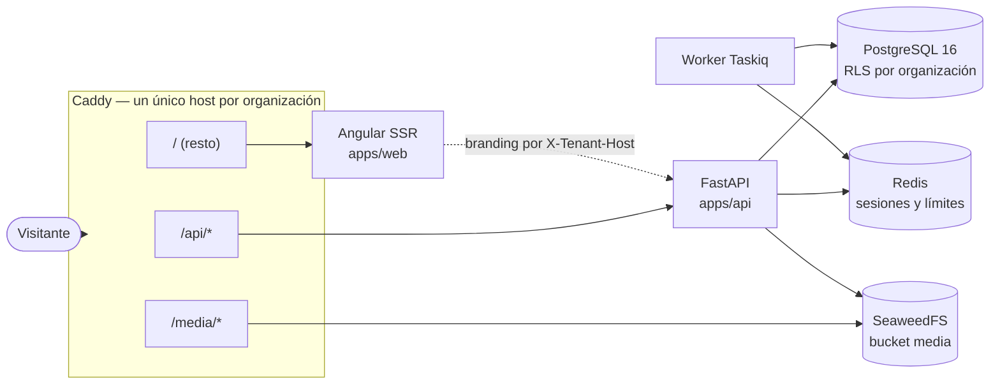
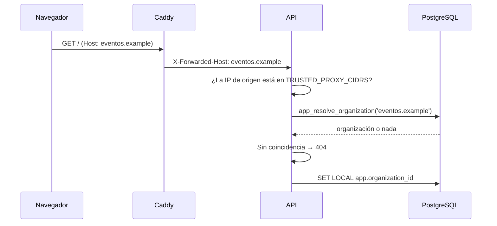

# Arquitectura

Plataforma de eventos multi-organización. Una sola instalación sirve a varias
organizaciones, cada una con su dominio, su marca y sus datos, aislados entre sí.

## Vista general



Web y API comparten host a propósito. De ahí salen tres propiedades: la cookie de
sesión es first-party sin configurar nada, no hace falta CORS en producción, y solo hay
una cabecera de host que revisar (`X-Forwarded-Host`) en lugar de un mapa de orígenes.

## Multi-tenant: tabla compartida con Row-Level Security

Todas las organizaciones comparten las mismas tablas, con una columna
`organization_id`. El aislamiento **no** depende de que cada consulta acuerde de
filtrar: lo impone PostgreSQL.

### Dos roles de base de datos

| Rol | `BYPASSRLS` | Quién lo usa |
|---|---|---|
| `app_user` | No | La API en todas sus peticiones (`engine_app`) |
| `app_maintainer` | Sí | Alembic, el CLI, el seed y el módulo `admin` (`engine_maintenance`) |

Los roles se crean en `infra/postgres/init/01-roles.sh`, fuera de Alembic: `CREATE
ROLE` es global al clúster y no se puede revertir con seguridad desde una migración.
`ALTER DEFAULT PRIVILEGES` hace que toda tabla futura sea accesible para `app_user` sin
grants manuales.

No existe ningún GUC de «bypass». Lo que necesita saltarse el aislamiento cambia de rol
de conexión, que es auditable, en vez de activar una variable de sesión que cualquier
error de código podría dejar puesta.

### Contexto y políticas

`app.core.deps.get_db` es el **único** punto que fija el contexto, y lo hace dentro de la
transacción abierta (`SET LOCAL` fuera de una transacción no tiene efecto):

```sql
SELECT set_config('app.organization_id', '<uuid>', true);
SELECT set_config('app.user_id', '<uuid>', true);
```

Las políticas (migración `0003_politicas_rls`) usan:

```sql
NULLIF(current_setting('app.organization_id', true), '')::uuid
```

Sin contexto la comparación es `NULL`, es decir falsa, y no se devuelve **ninguna**
fila. Es deliberado que no sea un error: cero filas es el comportamiento seguro y hace
que el olvido se detecte en los tests en lugar de en producción.

Todas las tablas de dominio llevan `ENABLE` + `FORCE ROW LEVEL SECURITY`. `FORCE` es
imprescindible: sin él, el propietario de la tabla se saltaría sus propias políticas.

`users` también está protegida, aunque sea global: una persona se ve a sí misma o a
quien comparta organización con ella.

### El problema del huevo y la gallina

Resolver la organización por host ocurre *antes* de que exista contexto. En lugar de
dar `BYPASSRLS` al rol de la API se expone una función `SECURITY DEFINER` de alcance
mínimo:

```sql
app_resolve_organization(host text) RETURNS TABLE (id uuid, slug text, is_active boolean)
```

El bypass queda acotado a esa consulta concreta y auditable, en vez de a todo el rol.

## Resolución de la organización



Reglas:

- Coincidencia **exacta** contra `organization_domains`. Ni subdominios ni comodines.
- `X-Forwarded-Host` solo se acepta desde una IP en `TRUSTED_PROXY_CIDRS`.
- Sin coincidencia, 404 antes de tocar ninguna otra tabla.
- `X-Organization-Slug` y `DEFAULT_ORGANIZATION_SLUG` existen solo con
  `APP_ENV=development`.
- El token debe pertenecer a la organización resuelta: si no, 403. Sin esto bastaría
  con cambiar el `Host` para llevarse una sesión de una organización a otra.

## Autenticación

| Token | Formato | Dónde vive | Duración |
|---|---|---|---|
| Access | JWT HS256 | Memoria del cliente (signal) | 15 min |
| Refresh | Opaco (`token_urlsafe`) | Cookie `HttpOnly; Secure; SameSite=Lax; Path=/api/v1/auth` | 7 días |

El algoritmo se fija explícitamente al verificar: aceptar el de la cabecera permitiría
degradar la firma a `none`. Las contraseñas usan Argon2id.

Los refresh tokens se agrupan en **familias** con rotación y detección de reutilización:
cada refresco emite uno nuevo y marca el anterior como usado; si aparece un token ya
usado se asume robo y se revoca la familia entera. El estado vive en Redis con TTL, y
si Redis no responde se devuelve 503 — nunca se acepta un token sin poder comprobar su
revocación.

### Token puente entre verificar el correo y crear la organización

Verificar el correo no implica tener organización todavía. `verify-email` emite un
access token normal pero con `organization_id = null` («puente»), solo para poder llamar
al alta de organización sin volver a loguear. El frontend lo guarda en un signal
separado del token de sesión (`bridgeToken`, no `token`), precisamente para que el guard
de autenticación no trate a alguien que solo tiene el puente como si tuviera una sesión
completa.

Tras crear la organización **no hay auto-login**: cada organización vive en su propio
subdominio (`{slug}.{dominio_base}`), y ni una cookie `Set-Cookie` emitida en el host
donde corre `/crear-organizacion` ni un token en memoria sobreviven una navegación a otro
origen. La respuesta del alta no lleva ningún token; el frontend enlaza a
`https://{host}/admin/login` para que la persona inicie sesión ya en el subdominio de su
organización.

### Cuenta propia: cambio de correo, contraseña y recuperación

Cambio de correo, cambio de contraseña y recuperación de contraseña comparten el
mismo mecanismo de tokens de un solo uso que `verify-email` (Redis + TTL, `GETDEL`
atómico), diferenciados por **propósito** en la clave: `email_verify`, `email_change`,
`password_reset`. Un token de un propósito nunca es válido en el endpoint de otro.

Confirmar un cambio de correo o completar una recuperación ocurre sin sesión propia
(quien llega por el enlace de correo no tiene `app.user_id` fijado), el mismo problema
del huevo y la gallina que `verify-email`. Se resuelve igual: dos funciones
`SECURITY DEFINER` de alcance mínimo, `app_change_user_email(uuid, text)` y
`app_set_user_password(uuid, text)`, en vez de dar `BYPASSRLS` a esos flujos.

`GET /users/me/organizations` (selector de organización del panel) tiene el problema
inverso: el contexto RLS lo fija el *host*, no la persona, así que no hay forma de
listar "mis organizaciones" con una consulta normal sin saber antes en qué host
preguntar. `app_user_organizations(p_user_id uuid)` resuelve esto devolviendo filas
solo cuando `p_user_id` coincide con `app.user_id` de la sesión — el parámetro no
permite consultar por un id arbitrario, es una comprobación adicional dentro de la
propia función, no una confianza ciega en quien la llama.

**Revocar todas las sesiones salvo la actual** (cambio de contraseña) necesita saber
la familia de refresh token de la petición en curso. La cookie de refresh tiene
`Path=/api/v1/auth`, así que endpoints fuera de ese prefijo (`/users/me/*`) nunca la
reciben. Por eso el access token JWT lleva también la familia (`"fam"` en el payload,
`AccessTokenClaims.family`): se fija al emitir el token (`issue_tokens`) y viaja de
vuelta en cada petición autenticada sin depender de la cookie. Redis mantiene además
un índice inverso familia→usuario (`refresh:familias_usuario:{user_id}`) para poder
revocar todas las familias de una persona sin recorrer Redis entero.

## Permisos y anti-escalada

El catálogo de permisos vive en código (`core/permissions.py`), no en base de datos: así
una migración no puede introducir un permiso que el código desconoce.

Los roles del sistema (`owner`, `organizer`, `speaker`, `volunteer`, `attendee`) son
plantillas en código que **se clonan** al crear cada organización. Ninguna fila tiene
`organization_id` nulo, así que RLS es uniforme, y cada organización puede personalizar
sus roles sin afectar a las demás.

Tres reglas impiden que `roles:write` se convierta en control total:

1. Nadie concede un permiso que no posee.
2. Solo un `owner` gestiona o asigna el rol `owner`.
3. Nadie amplía sus propios permisos modificando su membresía.

`AUDIT_READ` no existe como valor del enum `Permission` (fase 5 del PRD, decisión #7
del plan): si existiera, `OWNER.permissions = tuple(Permission)`
(`modules/roles/system_roles.py`) lo concedería automáticamente a todo `owner` futuro,
contradiciendo que la auditoría sea exclusiva de superadmin. El endpoint de auditoría
comprueba `is_superadmin` directamente, no un permiso de rol.

## Auditoría y RGPD (superadmin)

`AuditLog` (`app/core/audit.py`) es un log de solo-inserción: sin política RLS y sin el
`GRANT` por defecto que `ALTER DEFAULT PRIVILEGES` (`roles.sql`) le daría a `app_user`
sobre cualquier tabla nueva — la migración `0012` ejecuta `REVOKE ALL ON audit_log FROM
app_user` explícito, así que solo `app_maintainer` (`maintenance_session()`) puede leer
o escribir ahí. `cookie_consents` recibe el mismo `REVOKE` seguido de un `GRANT INSERT`
puntual, porque el endpoint público de consentimiento sí necesita escribir sin
autenticar. Retención de `audit_log`: indefinida, sin purga automática (es un log de
cumplimiento).

Se instrumenta explícitamente cada acción sensible existente — cambio de permisos de
un rol, alta de organización, alta de dominio — y las tres acciones nuevas de
superadmin (`app/modules/admin/router.py`): listado de auditoría con filtros, export
RGPD de un evento (ZIP con CSV de inscripciones/respuestas/entradas, sin el JWT del QR,
con prefijado `'` de celdas que empiezan por `=`/`+`/`-`/`@`/tab/CR contra inyección de
fórmulas) y borrado de un inscrito por email. Los tres exigen `is_superadmin` (403 para
cualquier otro rol), `limit_per_ip` y reautenticación por contraseña en el body de la
petición — no hay sesión de reautenticación aparte.

El borrado de un inscrito reutiliza el servicio de cancelación
(`registrations/service.py`), no un `DELETE` directo: así promueve automáticamente a la
siguiente persona en lista de espera. Los `event_ticket_scans` del ticket se anonimizan
(`ticket_id = NULL`) en vez de borrarse, para conservar el recuento real de aforo sin
conservar el vínculo con la persona. `audit_log.detail` guarda un hash con sal del
email, nunca en claro: el propio registro de auditoría no puede convertirse en el dato
personal que demuestra haber sido borrado.

## Almacenamiento de objetos

`StorageProvider` es un `Protocol`; `S3StorageProvider` (aioboto3, path-style) es la
implementación para SeaweedFS. Dos invariantes:

- Toda clave se construye con `build_object_key` → `orgs/{organization_id}/{tipo}/{uuid}.{ext}`.
  Una organización no puede escribir en el espacio de otra ni equivocándose.
- Toda subida pasa por `validate_upload`, que mira los **bytes reales** (no la extensión
  ni el `Content-Type` declarado) y acepta solo PNG, JPEG y WebP. SVG está prohibido:
  admite `<script>` y, servido desde nuestro host, sería XSS almacenado.

Los objetos públicos se sirven por `/media/*` en Caddy, no por bucket policy: en
SeaweedFS 3.97 `PutBucketPolicy` existe pero rechaza políticas estándar de AWS.

## Tareas asíncronas

Taskiq sobre `RedisStreamBroker`, no sobre una lista: Redis Streams confirma los
mensajes y permite reintentos, así que una tarea no desaparece si el worker se reinicia.

Las tareas programadas por cron (`@broker.task(schedule=[...])`) no las ejecuta el
`worker`: desde Taskiq 0.12 el planificador (`TaskiqScheduler` + `LabelScheduleSource`)
es un **proceso aparte**, arrancado con `taskiq scheduler app.core.tasks:scheduler`. El
`worker` solo consume la cola; sin el proceso `scheduler` corriendo, ninguna tarea con
`schedule` se dispara jamás, aunque el worker esté sano. Hoy hay una: el barrido horario
de cuentas sin verificar (`core/cleanup.sweep_unverified_accounts`), que avisa a los 5
días y borra a los 7.

## Pagos con Stripe Connect

Direct charges sobre Connect Standard: el cargo ocurre en la cuenta del
organizador, la plataforma nunca custodia dinero. Todas las llamadas al SDK
pasan por `payments/stripe_client.py`, el único fichero que lo importa
(`ruff` bloquea `import stripe` en cualquier otro sitio de `app/` con la
regla `TID251`): así el `acct_id` que viaja a Stripe siempre sale de una fila
ya resuelta (`organization_stripe_accounts` o `event_payments.
stripe_account_id`), nunca de un parámetro de cliente, en los tres caminos
que llaman a Stripe (petición HTTP, webhook, tareas de fondo).

### Flujo de una compra

1. El formulario público (`registration-page.ts`) pide tipo de entrada y
   código de descuento opcional, valida el precio con
   `POST /public/events/{slug}/checkout/quote` (informativo, no reserva
   nada) y envía la compra a `POST /public/events/{slug}/checkout`.
2. `checkout_service.iniciar_compra` corre en dos transacciones: la primera
   (con los bloqueos de fila del cupo del tipo de entrada y del uso del
   código) deja la inscripción en `pending_payment` y hace `commit` antes de
   llamar a Stripe; la segunda, sin ningún bloqueo abierto, crea la Checkout
   Session y guarda su `id`/URL. Ninguna llamada de red a Stripe ocurre
   nunca con una fila bloqueada.
3. El asistente paga en la página alojada por Stripe (Checkout hosted: el
   frontend nunca ve un `client_secret` de `PaymentIntent`).
4. Stripe llama al webhook con `checkout.session.completed`. El handler
   confirma la inscripción (`confirmed`) y llama a la misma
   `_enviar_email_por_estado` que usan los demás caminos de confirmación —
   nunca a `emitir_entrada` directamente desde `payments/` — que emite la
   entrada y envía el correo con el QR.

### La guarda de pago, en dos capas

Cuatro caminos distintos pueden dejar una inscripción en `confirmed`: el
alta directa, la verificación de email, la aprobación manual del
organizador y la promoción de lista de espera. Una guarda puesta en uno solo
de ellos deja los otros tres regalando entradas en un evento de pago. Por
eso la guarda vive en dos capas:

- **Capa 1** (`_estado_confirmable`, `registrations/service.py`): invocada
  desde los dos puntos de `_evaluar_estado_por_capacidad` que devuelven
  `"confirmed"` (cubre alta, verificación y aprobación) y desde
  `confirm_waitlist_promotion`. En un evento de pago sin cobro verificado,
  el estado resultante es `pending_payment`, nunca `confirmed`.
- **Capa 2**, cinturón de seguridad (`_enviar_email_por_estado`): se niega a
  emitir una entrada de un evento de pago si no hay un `event_payments` en
  `paid`. Protege cualquier camino nuevo que se añada más adelante, en el
  único sitio por el que necesariamente pasa la emisión.

### Webhook: ámbito «cuentas conectadas», sin tenant por `Host`

Todos los endpoints públicos resuelven la organización por el `Host` de la
petición. Stripe llama a una URL fija (`/api/v1/webhooks/stripe`, bajo el
mismo `API_PREFIX` que el resto de rutas — no hay ninguna ruta fuera de él),
sin ese `Host`: es la única ruta de la instalación que no lo usa. El
endpoint se registra en Stripe con `connect: true` (ámbito *cuentas
conectadas*) y un único secreto de firma, porque los cuatro eventos que
consume (`checkout.session.completed`, `charge.refunded`,
`account.updated`, `account.application.deauthorized`) llegan todos por ese
ámbito con direct charges. En local: `stripe listen --forward-connect-to
localhost:8000/api/v1/webhooks/stripe`.

El handler: (a) verifica la firma sobre el raw body antes de parsear nada;
(b) resuelve la organización a partir de `event.account` contra
`organization_stripe_accounts`, con `maintenance_session`; (c) localiza el
pago **solo** por el identificador que emitió la plataforma
(`stripe_checkout_session_id`/`stripe_payment_intent_id`, nunca por
`metadata` ni `client_reference_id`, que el organizador controla desde su
propio Dashboard de una cuenta Standard) y exige que su `organization_id`
coincida con el resuelto desde `event.account` antes de mutar nada. La
idempotencia se mide sobre el **proceso**, no sobre la recepción:
`stripe_webhook_events` guarda el estado (`received`/`processed`/
`ignored`/`failed`) y una tarea de barrido reencola lo que quedó `received`
sin terminar de procesarse, para que un evento perdido entre la cola y el
worker no deje un cobro sin inscripción confirmada.

### Reembolsos: outbox antes de llamar a Stripe

`_cancelar_inscripcion` (reutilizada por la cancelación del organizador, la
autocancelación pública y el borrado RGPD) toma bloqueos de fila sobre la
inscripción. Ninguna llamada de red a Stripe puede ocurrir ahí dentro: en su
lugar, persiste una fila de intención en `event_payment_refunds` y hace
`commit`. Una tarea de fondo, sin ningún bloqueo abierto, ejecuta el
reembolso contra Stripe con `idempotency_key` derivada de esa fila ya
persistida. Un reembolso total revoca la entrada con la `revocar_entrada` ya
existente de la fase 4; uno parcial no la revoca salvo que el organizador
marque la casilla explícita del panel.

El webhook (`/api/v1/webhooks/stripe`, ámbito «cuentas conectadas») solo
gestiona `checkout.session.completed` con `payment_method_types=["card"]`.
`checkout.session.async_payment_succeeded`/`async_payment_failed` —los
eventos de un método de pago diferido, que no resuelve en el mismo
`checkout.session.completed`— están **fuera del alcance de la fase 6 del
PRD**, documentado aquí a propósito, no ignorados en silencio: antes de
habilitar SEPA u otro método diferido en el Dashboard de una organización,
hace falta un handler para esos dos eventos que confirme o cancele la
inscripción `pending_payment` cuando el pago se resuelva de forma asíncrona,
en vez de asumir (como hoy) que `checkout.session.completed` ya trae el
resultado final.

## Frontend

Una sola aplicación Angular 21 sirve la web pública y el panel.

- **Público**: renderizado en servidor por petición (no prerenderizado), porque el
  contenido depende del host.
- **Panel**: solo cliente. Necesita la cookie de sesión, que el servidor no debe manejar.

El theming son custom properties CSS que Tailwind consume: cambiar los colores en la
base de datos cambia la interfaz sin recompilar. `TemplateRegistry` permite que cada
organización elija la plantilla de su portada, cargada de forma perezosa.

Si la API no responde, la aplicación muestra «sitio no disponible» en lugar de pintar la
paleta por defecto: enseñar una marca que no es la de la organización sería peor que
admitir el fallo.

### Páginas públicas con datos: SSR real, no solo plantilla

Las páginas públicas de evento, sesión y ponente (`features/public/events/`) piden
datos a la API durante el renderizado en servidor, siguiendo el mismo patrón que
`ThemingService` — no el de `home-page.ts`, que solo espera un `import()` dinámico
sin ninguna petición HTTP y por tanto serviría un hueco vacío (o, peor, datos de otra
organización por el atajo de desarrollo) si se copiara sin más para una página con
datos reales.

1. La petición usa `ApiService.url()` + `ApiService.serverForwardHeaders()`, para
   que en SSR lleve el `X-Forwarded-Host` real de la visita en vez del `Host`
   interno del contenedor.
2. La carga se registra con `PendingTasks.run(...)` dentro de `ngOnInit`: en modo
   zoneless, sin esto el renderizado en servidor no esperaría a la petición
   asíncrona y serializaría la página con el estado inicial vacío.
3. El resultado se guarda en `TransferState` con una clave propia por página
   (`makeStateKey`), para que el cliente no repita la petición al hidratar.
4. Un 404 de la API marca un estado "no encontrado" en el componente, que
   `NotFoundStatusService` (`core/ssr/not-found-status.service.ts`) traduce al
   código de estado HTTP real de la respuesta SSR mediante el token `RESPONSE_INIT`
   de `@angular/core` — `null` fuera de un renderizado en servidor real (build,
   CSR, SSG, extracción de rutas), así que `mark()` es un no-op seguro en
   cualquier otro contexto. No hace falta ninguna lógica adicional en
   `server.ts`: el motor de `@angular/ssr` ya construye la `Response` final a
   partir de ese mismo objeto antes de que `writeResponseToNodeResponse` la
   escriba.
5. Las etiquetas Open Graph (`og:title`, `og:description`, `og:image`) se fijan con
   `SeoMetaService` (`core/seo/meta.service.ts`), primer uso de `Meta`/`Title` de
   `@angular/platform-browser` en el proyecto.

El vídeo embebido (`features/public/events/video-embed.ts`) resuelve la URL del
reproductor oficial de cada plataforma (`youtube-nocookie.com`, `player.vimeo.com`,
`player.twitch.tv`) a partir del `video_url` guardado; para «otro» plantea un enlace
directo en vez de un `iframe` genérico que podría no cargar. El `src` de ese
`iframe` se marca con `DomSanitizer.bypassSecurityTrustResourceUrl`: es seguro
porque siempre se construye desde ese prefijo propio fijo, nunca a partir de la URL
cruda que guardó quien edita la sesión — esa URL ya pasó, además, la validación de
dominio por plataforma del backend (`validate_video_url`, ver
`docs/modelo-de-datos.md`).

### Páginas legales: SSR con texto plano primero, HTML saneado después

Las cuatro páginas legales (`/legal/aviso-legal`, `/legal/privacidad`,
`/legal/cookies`, `/legal/condiciones-de-inscripcion`, `features/public/legal/
legal-page.ts`) siguen el mismo patrón `TransferState`/`serverForwardHeaders()`
de arriba, con una diferencia deliberada: el contenido (Markdown restringido
editable por el tenant, ver `docs/modelo-de-datos.md`) se muestra primero como
texto plano interpolado por Angular — siempre escapado, tanto en SSR como antes
de hidratar — y solo se sustituye por HTML saneado (`marked` + `DOMPurify`,
`shared/legal/sanitize-markdown.ts`) dentro de `afterNextRender`, que nunca
corre en el servidor. Evita depender de `jsdom` en el bundle de SSR (`DOMPurify`
necesita un `window` real) a cambio de una mejora progresiva: sin JavaScript se
ve el texto sin formato Markdown, con JavaScript se ve el HTML enriquecido —
nunca hay una ventana en la que un `<script>` guardado como contenido legal
pudiera ejecutarse.

### Banner de cookies

`shared/cookies/cookie-banner.ts`, integrado en `layouts/public/public-shell.ts`
para aparecer en toda página pública. `core/cookies/cookie-consent.service.ts`
guarda la decisión en `localStorage` (cada organización ya vive en su propio
host, así que no hace falta espacio de nombres adicional) y llama a
`POST /public/cookie-consent`. Cloudflare Turnstile (`shared/ui/
turnstile-widget.ts`) nunca pasa por este servicio: sigue cargando decida lo
que decida la persona, clasificado como necesario en la página de cookies (ver
`apps/api/app/modules/legal/templates.py`). Un script de ejemplo de categoría
`analytics` (`core/cookies/dummy-analytics.service.ts`, `public/assets/
dummy-analytics.js`) solo se inyecta en el DOM tras consentimiento explícito,
para probar de verdad el bloqueo hasta que exista un script analítico real.

## Estructura

```
apps/api/app/
├── core/      config, database, security, storage, tenant, permissions, deps, tasks
├── modules/   health, auth, tenant, organizations, users, roles, admin, events
├── shared/    errors, pagination, dynamic_fields, identifiers
└── seed/

apps/web/src/app/
├── core/      api, auth, theming, tenant, i18n, seo, ssr
├── layouts/   public, admin
├── features/  public/* (incluida public/events), admin/*
└── shared/ui/
```

`modules/events` reúne eventos, agenda, roster de participantes y perfil público de
ponente: `router.py` (administración, autenticado), `public_router.py` (lecturas sin
autenticar bajo `/public/...`, con `limit_per_ip` en los cuatro endpoints) y
`speakers_repository.py` (historial de un ponente, compartido por ambos routers con
el filtro de publicación como parámetro explícito).

Regla: ningún fichero fuente supera las 1000 líneas, con 300 como objetivo.
