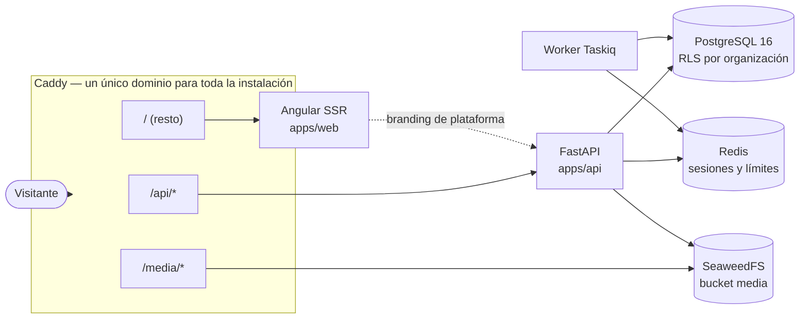
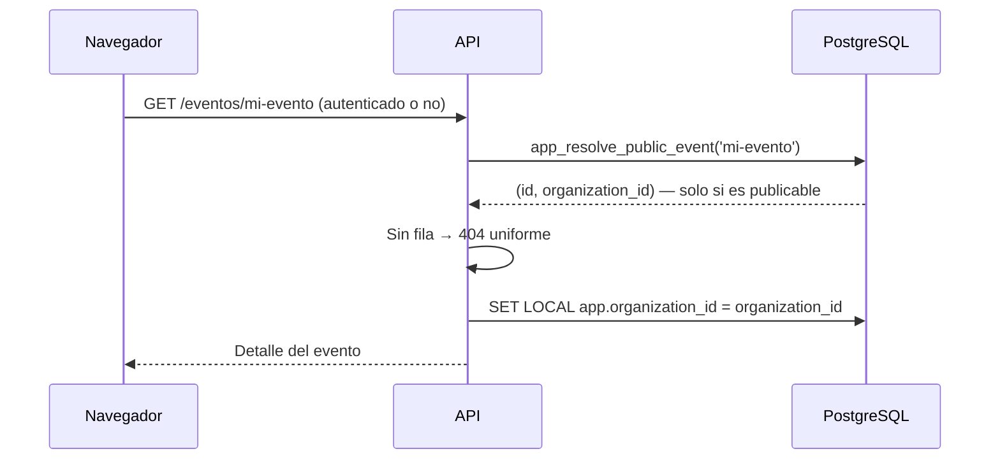

# Arquitectura

Plataforma de eventos multi-organización. Una sola instalación, en un único
dominio, sirve a varias organizaciones: cada una con su marca y sus datos,
aislados entre sí (plan «organización sin dominio», 2026-09-14: la organización
activa viene de la sesión, nunca del host visitado).

## Vista general



Web y API comparten host a propósito. De ahí salen dos propiedades: la cookie de
sesión es first-party sin configurar nada, y no hace falta CORS en producción.

## Multi-tenant: tabla compartida con Row-Level Security

Todas las organizaciones comparten las mismas tablas, con una columna
`organization_id`. El aislamiento **no** depende de que cada consulta acuerde de
filtrar: lo impone PostgreSQL.

### Dos roles de base de datos

| Rol | `BYPASSRLS` | Quién lo usa |
|---|---|---|
| `app_user` | No | La API en todas sus peticiones (`engine_app`) |
| `app_maintainer` | Sí | Alembic, el CLI, el seed y el módulo `admin` (`engine_maintenance`) |

Los roles se crean en `infra/postgres/init/01-roles.sh`, fuera de Alembic: `CREATE
ROLE` es global al clúster y no se puede revertir con seguridad desde una migración.
`ALTER DEFAULT PRIVILEGES` hace que toda tabla futura sea accesible para `app_user` sin
grants manuales.

No existe ningún GUC de «bypass». Lo que necesita saltarse el aislamiento cambia de rol
de conexión, que es auditable, en vez de activar una variable de sesión que cualquier
error de código podría dejar puesta.

### Contexto y políticas

`app.core.deps.get_db` es el **único** punto que fija el contexto, y lo hace dentro de la
transacción abierta (`SET LOCAL` fuera de una transacción no tiene efecto):

```sql
SELECT set_config('app.organization_id', '<uuid>', true);
SELECT set_config('app.user_id', '<uuid>', true);
```

Las políticas (migración `0003_politicas_rls`) usan:

```sql
NULLIF(current_setting('app.organization_id', true), '')::uuid
```

Sin contexto la comparación es `NULL`, es decir falsa, y no se devuelve **ninguna**
fila. Es deliberado que no sea un error: cero filas es el comportamiento seguro y hace
que el olvido se detecte en los tests en lugar de en producción.

Todas las tablas de dominio llevan `ENABLE` + `FORCE ROW LEVEL SECURITY`. `FORCE` es
imprescindible: sin él, el propietario de la tabla se saltaría sus propias políticas.

`users` también está protegida, aunque sea global: una persona se ve a sí misma o a
quien comparta organización con ella.

### El problema del huevo y la gallina

Varias operaciones ocurren *antes* de que exista contexto de organización: el
login (busca a la persona por correo en una tabla global), la resolución pública
de un evento por su slug (todavía no se sabe de qué organización es), el alta
autoservicio de una organización (una organización que aún no existe no puede
ser el contexto de nadie) o aceptar una invitación. En lugar de dar `BYPASSRLS`
al rol de la API, cada una se resuelve con una función `SECURITY DEFINER` de
alcance mínimo — `app_find_user_by_email`, `app_resolve_public_event`,
`app_create_organization_row`, `app_accept_invited_user`… — que devuelve solo
las columnas necesarias para el paso siguiente. El bypass queda acotado a una
consulta concreta y auditable, en vez de a todo el rol.

## Organización activa y resolución pública

Sin dominio por organización, ninguna petición decide nada a partir del
`Host`. La organización se resuelve por uno de dos caminos, según quién
pregunta:

**Panel autenticado: la organización activa de la sesión.** El access token
JWT lleva un claim `org` (`organization_id`) fijado al emitirlo. El login
valida la identidad globalmente (correo + contraseña; `users` es una tabla
global) y elige la organización activa inicial: la única a la que se
pertenece, o la más reciente por `last_seen_at` si hay varias. Cambiar de
organización activa es `POST /auth/switch-organization`: comprueba
pertenencia real (misma consulta que `app_user_organizations`, sin ninguna
rama para `is_superadmin` — el acceso de un superadmin a una organización
ajena tiene un único camino auditado, la impersonación) y emite un token
nuevo con ese `org`. Un intento de cambiar a una organización ajena devuelve
el mismo error que si no existiera, para no confirmar UUIDs válidos.

**Público: desde el propio recurso.** Las páginas públicas de evento,
inscripción, entrada o invitación llevan el identificador del recurso en la
URL (`/eventos/{slug}`, tokens de verificación…). La función
`app_resolve_public_event(slug)` devuelve solo `(id, organization_id)` y
únicamente si el evento es publicable — la comprobación de visibilidad va
dentro de la función, no después, así que un evento no publicable ni
siquiera revela que existe por su slug. Con el `organization_id` en mano, el
router fija el contexto RLS igual que `checkout_service.iniciar_compra` y a
partir de ahí todo se sirve con las políticas normales.



El listado público (`GET /public/events`) lista los eventos publicables de
**toda la instalación**: `app_list_public_event_organizations()` devuelve los
`id` de organización con al menos un evento publicable y el endpoint fija el
contexto RLS organización a organización, reutilizando las mismas consultas
que el listado por organización que sustituye. `POST /public/cookie-consent`
es de plataforma (`organization_id` siempre `NULL`), como las cuatro páginas
legales.

## Autenticación

| Token | Formato | Dónde vive | Duración |
|---|---|---|---|
| Access | JWT HS256 | Memoria del cliente (signal) | 15 min |
| Refresh | Opaco (`token_urlsafe`) | Cookie `HttpOnly; Secure; SameSite=Lax; Path=/api/v1/auth` | 7 días |

El algoritmo se fija explícitamente al verificar: aceptar el de la cabecera permitiría
degradar la firma a `none`. Las contraseñas usan Argon2id.

Los refresh tokens se agrupan en **familias** con rotación y detección de reutilización:
cada refresco emite uno nuevo y marca el anterior como usado; si aparece un token ya
usado se asume robo y se revoca la familia entera. El estado vive en Redis con TTL, y
si Redis no responde se devuelve 503 — nunca se acepta un token sin poder comprobar su
revocación.

### Token puente entre verificar el correo y crear la organización

Verificar el correo no implica tener organización todavía. `verify-email` emite un
access token normal pero con `organization_id = null` («puente»), solo para poder llamar
al alta de organización sin volver a loguear. El frontend lo guarda en un signal
separado del token de sesión (`bridgeToken`, no `token`), precisamente para que el guard
de autenticación no trate a alguien que solo tiene el puente como si tuviera una sesión
completa.

Tras crear la organización **la sesión queda activa en ella**: el propio
`POST /organizations` emite tokens completos como `/auth/login` (access token
con la organización recién creada como activa, cookie de refresco incluida).
Quien llega aquí puede venir del enlace de verificación de correo sin ninguna
cookie todavía, así que sin esto no habría sesión que activar — y sin dominio
por organización no hay ningún otro sitio al que redirigir para conseguirla.

### Cuenta propia: cambio de correo, contraseña y recuperación

Cambio de correo, cambio de contraseña y recuperación de contraseña comparten el
mismo mecanismo de tokens de un solo uso que `verify-email` (Redis + TTL, `GETDEL`
atómico), diferenciados por **propósito** en la clave: `email_verify`, `email_change`,
`password_reset`. Un token de un propósito nunca es válido en el endpoint de otro.

Confirmar un cambio de correo o completar una recuperación ocurre sin sesión propia
(quien llega por el enlace de correo no tiene `app.user_id` fijado), el mismo problema
del huevo y la gallina que `verify-email`. Se resuelve igual: dos funciones
`SECURITY DEFINER` de alcance mínimo, `app_change_user_email(uuid, text)` y
`app_set_user_password(uuid, text)`, en vez de dar `BYPASSRLS` a esos flujos.

`GET /users/me/organizations` (selector de organización del panel) tiene el problema
inverso: el contexto RLS está fijado a la organización **activa**, así que una
consulta normal solo vería esa, no todas las de la persona.
`app_user_organizations(p_user_id uuid)` resuelve esto devolviendo filas solo cuando
`p_user_id` coincide con `app.user_id` de la sesión — el parámetro no permite
consultar por un id arbitrario, es una comprobación adicional dentro de la propia
función, no una confianza ciega en quien la llama.

**Revocar todas las sesiones salvo la actual** (cambio de contraseña) necesita saber
la familia de refresh token de la petición en curso. La cookie de refresh tiene
`Path=/api/v1/auth`, así que endpoints fuera de ese prefijo (`/users/me/*`) nunca la
reciben. Por eso el access token JWT lleva también la familia (`"fam"` en el payload,
`AccessTokenClaims.family`): se fija al emitir el token (`issue_tokens`) y viaja de
vuelta en cada petición autenticada sin depender de la cookie. Redis mantiene además
un índice inverso familia→usuario (`refresh:familias_usuario:{user_id}`) para poder
revocar todas las familias de una persona sin recorrer Redis entero.

### Invitaciones: activar un camino de entrada que ya existía sin usar

`add_member` ya creaba una cuenta sin contraseña cuando el correo invitado no existía
(`organizations/members_service.py`), y `reset_password` ya sabía completar esa cuenta:
el mecanismo de entrada estaba construido antes de este PRD, solo no tenía estado
(no había forma de saber qué invitaciones seguían pendientes, ni de reenviarlas o
revocarlas) ni un correo propio. `count(*)` de usuarios sin contraseña en la base de
desarrollo, antes de activarlo: **0** — el camino existía sin que nadie lo hubiera
recorrido nunca.

**`organization_invitations`** guarda el estado (`pendiente`, `aceptada`, `revocada`;
`caducada` se deriva de `expires_at` al leer, nunca se escribe), no el token. El token
va al mismo mecanismo de Redis+TTL que el resto (`auth/verification.py`), con su propio
propósito: `invitacion`. `token_hash` en la fila es la huella SHA-256 del token vigente
—no el token, igual que `password_hash` no es la contraseña—, y existe solo para que
reenviar una invitación pueda borrar la clave de Redis del token anterior por su nombre
exacto sin haberlo guardado nunca en claro.

**Por qué la invitación no reutiliza el enlace de recuperación de contraseña** (hallazgo
S-1 del red-team, la decisión de seguridad que más fácil se rompe con el tiempo si
alguien la olvida): `reset_password` no comprueba que el correo del token coincida con
el de la cuenta —el token **es** la prueba de identidad—, así que si una invitación
emitiera un token de `password_reset`, invitar el correo de otra persona a un rol
cualquiera sería fijarle una contraseña nueva sin su consentimiento. La clave de Redis
incluye el propósito (`verify:{proposito}:{huella}`), así que un token de `invitacion`
es inconsumible en `/auth/reset-password` y al revés — la separación de propósitos no es
un detalle de implementación, es lo que cierra el secuestro de cuenta.

**Regla dura complementaria:** un correo que **ya tiene cuenta** nunca recibe un token de
invitación. Se le añade la membresía directamente (mismo camino que el alta manual,
`add_member`) y se le avisa, sin token de ningún tipo — «tal como se haría en otra
plataforma» (decisión del usuario). Esto es lo que permite además que la misma persona
sea ponente en dos organizaciones distintas sin duplicar su cuenta: `users` es global a
la instalación, así que invitar un correo que ya existe en otra organización la
reconoce y añade, nunca la duplica.

`invitations_service.accept_invitation` fija la contraseña y el nombre con
`app_accept_invited_user` (`SECURITY DEFINER`, mismo motivo que `app_set_user_password`:
quien acepta no tiene sesión propia ni comparte organización con nadie todavía) y crea
la membresía **antes** de esa llamada, en la misma transacción: una vez existe la fila
de `organization_members`, `tenant_users` (RLS) la hace visible para la comprobación de
`UPDATE` de esa misma transacción sin necesitar una segunda función privilegiada.

**Un ponente invitado no edita su propia sesión, declarado a propósito.** El rol
`speaker` tiene un único permiso, `ORGANIZATIONS_READ` — el editor de sesión vive
detrás de `EVENTS_WRITE`, que ese rol no tiene. Los materiales de una charla los
sube el organizador, no la persona que la imparte; `event-roster.ts` lo dice al
invitar. No es un olvido: la alternativa (un permiso acotado a "solo mis
sesiones") queda anotada para un PRD aparte porque tiene un caso sin resolver —
dos ponentes en la misma sesión, y uno pisando los materiales del otro.

**Lo que este plan deja fuera, también declarado:** un catálogo de patrocinadores
reutilizable entre organizaciones (hoy cada patrocinio es por evento) y la
moderación de eventos desde la plataforma (suspender o cancelar un evento ajeno)
no entran aquí — cada uno necesita su propio modelo de datos y sus propias
decisiones, y forzarlos en este PRD habría sido sobre-alcance.

## Permisos y anti-escalada

El catálogo de permisos vive en código (`core/permissions.py`), no en base de datos: así
una migración no puede introducir un permiso que el código desconoce.

Los roles del sistema (`owner`, `organizer`, `speaker`, `volunteer`, `attendee`) son
plantillas en código que **se clonan** al crear cada organización. Ninguna fila tiene
`organization_id` nulo, así que RLS es uniforme, y cada organización puede personalizar
sus roles sin afectar a las demás.

Tres reglas impiden que `roles:write` se convierta en control total:

1. Nadie concede un permiso que no posee.
2. Solo un `owner` gestiona o asigna el rol `owner`.
3. Nadie amplía sus propios permisos modificando su membresía.

`AUDIT_READ` no existe como valor del enum `Permission` (fase 5 del PRD, decisión #7
del plan): si existiera, `OWNER.permissions = tuple(Permission)`
(`modules/roles/system_roles.py`) lo concedería automáticamente a todo `owner` futuro,
contradiciendo que la auditoría sea exclusiva de superadmin. El endpoint de auditoría
comprueba `is_superadmin` directamente, no un permiso de rol.

## Auditoría y RGPD (superadmin)

`AuditLog` (`app/core/audit.py`) es un log de solo-inserción: sin política RLS y sin el
`GRANT` por defecto que `ALTER DEFAULT PRIVILEGES` (`roles.sql`) le daría a `app_user`
sobre cualquier tabla nueva — la migración `0012` ejecuta `REVOKE ALL ON audit_log FROM
app_user` explícito, así que solo `app_maintainer` (`maintenance_session()`) puede leer
o escribir ahí. `cookie_consents` recibe el mismo `REVOKE` seguido de un `GRANT INSERT`
puntual, porque el endpoint público de consentimiento sí necesita escribir sin
autenticar. Retención de `audit_log`: indefinida, sin purga automática (es un log de
cumplimiento).

Se instrumenta explícitamente cada acción sensible existente — cambio de permisos de
un rol, alta de organización — y las tres acciones nuevas de
superadmin (`app/modules/admin/router.py`): listado de auditoría con filtros, export
RGPD de un evento (ZIP con CSV de inscripciones/respuestas/entradas, sin el JWT del QR,
con prefijado `'` de celdas que empiezan por `=`/`+`/`-`/`@`/tab/CR contra inyección de
fórmulas) y borrado de un inscrito por email. Los tres exigen `is_superadmin` (403 para
cualquier otro rol), `limit_per_ip` y reautenticación por contraseña en el body de la
petición — no hay sesión de reautenticación aparte.

El borrado de un inscrito reutiliza el servicio de cancelación
(`registrations/service.py`), no un `DELETE` directo: así promueve automáticamente a la
siguiente persona en lista de espera. Los `event_ticket_scans` del ticket se anonimizan
(`ticket_id = NULL`) en vez de borrarse, para conservar el recuento real de aforo sin
conservar el vínculo con la persona. `audit_log.detail` guarda un hash con sal del
email, nunca en claro: el propio registro de auditoría no puede convertirse en el dato
personal que demuestra haber sido borrado.

## Almacenamiento de objetos

`StorageProvider` es un `Protocol`; `S3StorageProvider` (aioboto3, path-style) es la
implementación para SeaweedFS. Dos invariantes:

- Toda clave se construye con `build_object_key` → `orgs/{organization_id}/{tipo}/{uuid}.{ext}`.
  Una organización no puede escribir en el espacio de otra ni equivocándose.
- Toda subida pasa por `validate_upload`, que mira los **bytes reales** (no la extensión
  ni el `Content-Type` declarado) y acepta solo PNG, JPEG y WebP. SVG está prohibido:
  admite `<script>` y, servido desde nuestro host, sería XSS almacenado.

Los objetos públicos se sirven por `/media/*` en Caddy, no por bucket policy: en
SeaweedFS 3.97 `PutBucketPolicy` existe pero rechaza políticas estándar de AWS.

## Servidor MCP para asistentes

Uso, ámbitos y herramientas en [`mcp.md`](mcp.md). Lo que condiciona el diseño:

- **Una sola puerta**: `VerificadorEventarium` resuelve la conexión (clave
  `evtm_` o JWT OAuth) con funciones `SECURITY DEFINER` y, en cada petición,
  recalcula ámbitos = concedidos ∩ permisos del rol. Las herramientas trabajan
  después con el contexto RLS de la persona, como la web.
- **Sin datos personales**: los modelos de salida tienen campos cerrados y
  las inscripciones solo salen como cifras.
- **Tokens separados**: el JWT del MCP lleva otro tipo, otra audiencia y otro
  secreto; ninguno de los dos verificadores acepta el token del otro.
- **Borrador por defecto**: `crear_evento` nunca publica; publicar y cancelar
  son ámbitos aparte, y cancelar exige confirmar con un código de un solo uso.

## Tareas asíncronas

Taskiq sobre `RedisStreamBroker`, no sobre una lista: Redis Streams confirma los
mensajes y permite reintentos, así que una tarea no desaparece si el worker se reinicia.

Las tareas programadas por cron (`@broker.task(schedule=[...])`) no las ejecuta el
`worker`: desde Taskiq 0.12 el planificador (`TaskiqScheduler` + `LabelScheduleSource`)
es un **proceso aparte**, arrancado con `taskiq scheduler app.core.tasks:scheduler`. El
`worker` solo consume la cola; sin el proceso `scheduler` corriendo, ninguna tarea con
`schedule` se dispara jamás, aunque el worker esté sano. Hoy hay una: el barrido horario
de cuentas sin verificar (`core/cleanup.sweep_unverified_accounts`), que avisa a los 5
días y borra a los 7.

## Pagos con Stripe Connect

Direct charges sobre Connect Standard: el cargo ocurre en la cuenta del
organizador, la plataforma nunca custodia dinero. Todas las llamadas al SDK
pasan por `payments/stripe_client.py`, el único fichero que lo importa
(`ruff` bloquea `import stripe` en cualquier otro sitio de `app/` con la
regla `TID251`): así el `acct_id` que viaja a Stripe siempre sale de una fila
ya resuelta (`organization_stripe_accounts` o `event_payments.
stripe_account_id`), nunca de un parámetro de cliente, en los tres caminos
que llaman a Stripe (petición HTTP, webhook, tareas de fondo).

### Flujo de una compra

1. El formulario público (`registration-page.ts`) pide tipo de entrada y
   código de descuento opcional, valida el precio con
   `POST /public/events/{slug}/checkout/quote` (informativo, no reserva
   nada) y envía la compra a `POST /public/events/{slug}/checkout`.
2. `checkout_service.iniciar_compra` corre en dos transacciones: la primera
   (con los bloqueos de fila del cupo del tipo de entrada y del uso del
   código) deja la inscripción en `pending_payment` y hace `commit` antes de
   llamar a Stripe; la segunda, sin ningún bloqueo abierto, crea la Checkout
   Session y guarda su `id`/URL. Ninguna llamada de red a Stripe ocurre
   nunca con una fila bloqueada.
3. El asistente paga en la página alojada por Stripe (Checkout hosted: el
   frontend nunca ve un `client_secret` de `PaymentIntent`).
4. Stripe llama al webhook con `checkout.session.completed`. El handler
   confirma la inscripción (`confirmed`) y llama a la misma
   `_enviar_email_por_estado` que usan los demás caminos de confirmación —
   nunca a `emitir_entrada` directamente desde `payments/` — que emite la
   entrada y envía el correo con el QR.

### La guarda de pago, en dos capas

Cuatro caminos distintos pueden dejar una inscripción en `confirmed`: el
alta directa, la verificación de email, la aprobación manual del
organizador y la promoción de lista de espera. Una guarda puesta en uno solo
de ellos deja los otros tres regalando entradas en un evento de pago. Por
eso la guarda vive en dos capas:

- **Capa 1** (`_estado_confirmable`, `registrations/service.py`): invocada
  desde los dos puntos de `_evaluar_estado_por_capacidad` que devuelven
  `"confirmed"` (cubre alta, verificación y aprobación) y desde
  `confirm_waitlist_promotion`. En un evento de pago sin cobro verificado,
  el estado resultante es `pending_payment`, nunca `confirmed`.
- **Capa 2**, cinturón de seguridad (`_enviar_email_por_estado`): se niega a
  emitir una entrada de un evento de pago si no hay un `event_payments` en
  `paid`. Protege cualquier camino nuevo que se añada más adelante, en el
  único sitio por el que necesariamente pasa la emisión.

### Webhook: ámbito «cuentas conectadas»

Stripe llama a una URL fija (`/api/v1/webhooks/stripe`, bajo el mismo
`API_PREFIX` que el resto de rutas — no hay ninguna ruta fuera de él) y sin
autenticar. El endpoint se registra en Stripe con `connect: true` (ámbito
*cuentas conectadas*) y un único secreto de firma, porque los cuatro eventos
que consume (`checkout.session.completed`, `charge.refunded`,
`account.updated`, `account.application.deauthorized`) llegan todos por ese
ámbito con direct charges. En local: `stripe listen --forward-connect-to
localhost:8000/api/v1/webhooks/stripe`.

El handler: (a) verifica la firma sobre el raw body antes de parsear nada;
(b) resuelve la organización a partir de `event.account` contra
`organization_stripe_accounts`, con `maintenance_session`; (c) localiza el
pago **solo** por el identificador que emitió la plataforma
(`stripe_checkout_session_id`/`stripe_payment_intent_id`, nunca por
`metadata` ni `client_reference_id`, que el organizador controla desde su
propio Dashboard de una cuenta Standard) y exige que su `organization_id`
coincida con el resuelto desde `event.account` antes de mutar nada. La
idempotencia se mide sobre el **proceso**, no sobre la recepción:
`stripe_webhook_events` guarda el estado (`received`/`processed`/
`ignored`/`failed`) y una tarea de barrido reencola lo que quedó `received`
sin terminar de procesarse, para que un evento perdido entre la cola y el
worker no deje un cobro sin inscripción confirmada.

### Reembolsos: outbox antes de llamar a Stripe

`_cancelar_inscripcion` (reutilizada por la cancelación del organizador, la
autocancelación pública y el borrado RGPD) toma bloqueos de fila sobre la
inscripción. Ninguna llamada de red a Stripe puede ocurrir ahí dentro: en su
lugar, persiste una fila de intención en `event_payment_refunds` y hace
`commit`. Una tarea de fondo, sin ningún bloqueo abierto, ejecuta el
reembolso contra Stripe con `idempotency_key` derivada de esa fila ya
persistida. Un reembolso total revoca la entrada con la `revocar_entrada` ya
existente de la fase 4; uno parcial no la revoca salvo que el organizador
marque la casilla explícita del panel.

El webhook (`/api/v1/webhooks/stripe`, ámbito «cuentas conectadas») solo
gestiona `checkout.session.completed` con `payment_method_types=["card"]`.
`checkout.session.async_payment_succeeded`/`async_payment_failed` —los
eventos de un método de pago diferido, que no resuelve en el mismo
`checkout.session.completed`— están **fuera del alcance de la fase 6 del
PRD**, documentado aquí a propósito, no ignorados en silencio: antes de
habilitar SEPA u otro método diferido en el Dashboard de una organización,
hace falta un handler para esos dos eventos que confirme o cancele la
inscripción `pending_payment` cuando el pago se resuelva de forma asíncrona,
en vez de asumir (como hoy) que `checkout.session.completed` ya trae el
resultado final.

## Frontend

Una sola aplicación Angular 21 sirve la web pública y el panel.

- **Público**: renderizado en servidor por petición (no prerenderizado), porque el
  contenido depende del recurso (el evento de la URL). La raíz (`/`) es la landing
  de la instalación (`features/public/landing`: presentación, franja de eventos en
  directo, funcionalidades, cómo colaborar); el directorio de eventos de toda la
  instalación sigue en `/eventos`. Las animaciones de la landing (GSAP) se cargan
  solo en navegador y solo sin `prefers-reduced-motion`; el HTML servido no depende
  de ellas.
- **Panel**: solo cliente. Necesita la cookie de sesión, que el servidor no debe manejar.

El theming son custom properties CSS que Tailwind consume: cambiar los colores en la
base de datos cambia la interfaz sin recompilar. Hay dos ámbitos — la plataforma
(chrome de toda la web, `GET /tenant/branding`) y el evento (plantilla propia, si la
eligió, aplicada al contenedor de su página pública). Sin dominio por organización
no existe una tercera identidad «del sitio»: la marca de una organización concreta
solo aparece dentro de las páginas de sus eventos.

Si la API no responde, la aplicación muestra «sitio no disponible» en lugar de pintar la
paleta por defecto: enseñar una marca que no es la real sería peor que admitir el fallo.

### Páginas públicas con datos: SSR real, no solo plantilla

Las páginas públicas de evento, sesión y ponente (`features/public/events/`) piden
datos a la API durante el renderizado en servidor, siguiendo el mismo patrón que
`ThemingService` — cada página resuelve su recurso por el slug de la URL, nunca
por el host de la visita.

1. La petición usa `ApiService.url()` + `ApiService.serverForwardHeaders()`, que
   en SSR propagan el protocolo real de la visita.
2. La carga se registra con `PendingTasks.run(...)` dentro de `ngOnInit`: en modo
   zoneless, sin esto el renderizado en servidor no esperaría a la petición
   asíncrona y serializaría la página con el estado inicial vacío.
3. El resultado se guarda en `TransferState` con una clave propia por página
   (`makeStateKey`), para que el cliente no repita la petición al hidratar.
4. Un 404 de la API marca un estado "no encontrado" en el componente, que
   `NotFoundStatusService` (`core/ssr/not-found-status.service.ts`) traduce al
   código de estado HTTP real de la respuesta SSR mediante el token `RESPONSE_INIT`
   de `@angular/core` — `null` fuera de un renderizado en servidor real (build,
   CSR, SSG, extracción de rutas), así que `mark()` es un no-op seguro en
   cualquier otro contexto. No hace falta ninguna lógica adicional en
   `server.ts`: el motor de `@angular/ssr` ya construye la `Response` final a
   partir de ese mismo objeto antes de que `writeResponseToNodeResponse` la
   escriba.
5. Las etiquetas Open Graph (`og:title`, `og:description`, `og:image`) se fijan con
   `SeoMetaService` (`core/seo/meta.service.ts`), primer uso de `Meta`/`Title` de
   `@angular/platform-browser` en el proyecto.

El vídeo embebido (`features/public/events/video-embed.ts`) resuelve la URL del
reproductor oficial de cada plataforma (`youtube-nocookie.com`, `player.vimeo.com`,
`player.twitch.tv`) a partir del `video_url` guardado; para «otro» plantea un enlace
directo en vez de un `iframe` genérico que podría no cargar. El `src` de ese
`iframe` se marca con `DomSanitizer.bypassSecurityTrustResourceUrl`: es seguro
porque siempre se construye desde ese prefijo propio fijo, nunca a partir de la URL
cruda que guardó quien edita la sesión — esa URL ya pasó, además, la validación de
dominio por plataforma del backend (`validate_video_url`, ver
`docs/modelo-de-datos.md`).

### Páginas legales: SSR con texto plano primero, HTML saneado después

Las cuatro páginas legales (`/legal/aviso-legal`, `/legal/privacidad`,
`/legal/cookies`, `/legal/condiciones-de-inscripcion`, `features/public/legal/
legal-page.ts`) siguen el mismo patrón `TransferState`/`serverForwardHeaders()`
de arriba, con una diferencia deliberada: el contenido (Markdown restringido,
editable solo por la plataforma, ver `docs/modelo-de-datos.md`) se muestra primero como
texto plano interpolado por Angular — siempre escapado, tanto en SSR como antes
de hidratar — y solo se sustituye por HTML saneado (`marked` + `DOMPurify`,
`shared/legal/sanitize-markdown.ts`) dentro de `afterNextRender`, que nunca
corre en el servidor. Evita depender de `jsdom` en el bundle de SSR (`DOMPurify`
necesita un `window` real) a cambio de una mejora progresiva: sin JavaScript se
ve el texto sin formato Markdown, con JavaScript se ve el HTML enriquecido —
nunca hay una ventana en la que un `<script>` guardado como contenido legal
pudiera ejecutarse.

### Banner de cookies

`shared/cookies/cookie-banner.ts`, integrado en `layouts/public/public-shell.ts`
para aparecer en toda página pública. `core/cookies/cookie-consent.service.ts`
guarda la decisión en `localStorage` y llama a
`POST /public/cookie-consent` (registro de plataforma, sin organización:
`organization_id` siempre `NULL`). Cloudflare Turnstile (`shared/ui/
turnstile-widget.ts`) nunca pasa por este servicio: sigue cargando decida lo
que decida la persona, clasificado como necesario en la página de cookies (ver
`apps/api/app/modules/legal/templates.py`). Un script de ejemplo de categoría
`analytics` (`core/cookies/dummy-analytics.service.ts`, `public/assets/
dummy-analytics.js`) solo se inyecta en el DOM tras consentimiento explícito,
para probar de verdad el bloqueo hasta que exista un script analítico real.

## Estructura

```
apps/api/app/
├── core/      config, database, security, storage, tenant, permissions, deps, tasks
├── modules/   health, auth, tenant, organizations, users, roles, admin, events
├── shared/    errors, pagination, dynamic_fields, identifiers
└── seed/

apps/web/src/app/
├── core/      api, auth, theming, tenant, i18n, seo, ssr
├── layouts/   public, admin
├── features/  public/* (incluida public/events), admin/*
└── shared/ui/
```

`modules/events` reúne eventos, agenda, roster de participantes y perfil público de
ponente: `router.py` (administración, autenticado), `public_router.py` (lecturas sin
autenticar bajo `/public/...`, con `limit_per_ip` en los cuatro endpoints) y
`speakers_repository.py` (historial de un ponente, compartido por ambos routers con
el filtro de publicación como parámetro explícito).

Regla: ningún fichero fuente supera las 1000 líneas, con 300 como objetivo.
