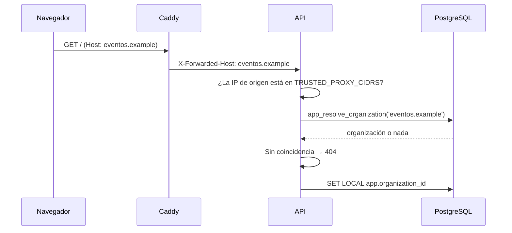

# Arquitectura

Plataforma de eventos multi-organización. Una sola instalación sirve a varias
organizaciones, cada una con su dominio, su marca y sus datos, aislados entre sí.

## Vista general


Web y API comparten host a propósito. De ahí salen tres propiedades: la cookie de
sesión es first-party sin configurar nada, no hace falta CORS en producción, y solo hay
una cabecera de host que revisar (`X-Forwarded-Host`) en lugar de un mapa de orígenes.

## Multi-tenant: tabla compartida con Row-Level Security

Todas las organizaciones comparten las mismas tablas, con una columna
`organization_id`. El aislamiento **no** depende de que cada consulta acuerde de
filtrar: lo impone PostgreSQL.

### Dos roles de base de datos

| Rol | `BYPASSRLS` | Quién lo usa |
|---|---|---|
| `app_user` | No | La API en todas sus peticiones (`engine_app`) |
| `app_maintainer` | Sí | Alembic, el CLI, el seed y el módulo `admin` (`engine_maintenance`) |

Los roles se crean en `infra/postgres/init/01-roles.sh`, fuera de Alembic: `CREATE
ROLE` es global al clúster y no se puede revertir con seguridad desde una migración.
`ALTER DEFAULT PRIVILEGES` hace que toda tabla futura sea accesible para `app_user` sin
grants manuales.

No existe ningún GUC de «bypass». Lo que necesita saltarse el aislamiento cambia de rol
de conexión, que es auditable, en vez de activar una variable de sesión que cualquier
error de código podría dejar puesta.

### Contexto y políticas

`app.core.deps.get_db` es el **único** punto que fija el contexto, y lo hace dentro de la
transacción abierta (`SET LOCAL` fuera de una transacción no tiene efecto):

```sql
SELECT set_config('app.organization_id', '<uuid>', true);
SELECT set_config('app.user_id', '<uuid>', true);
```

Las políticas (migración `0003_politicas_rls`) usan:

```sql
NULLIF(current_setting('app.organization_id', true), '')::uuid
```

Sin contexto la comparación es `NULL`, es decir falsa, y no se devuelve **ninguna**
fila. Es deliberado que no sea un error: cero filas es el comportamiento seguro y hace
que el olvido se detecte en los tests en lugar de en producción.

Todas las tablas de dominio llevan `ENABLE` + `FORCE ROW LEVEL SECURITY`. `FORCE` es
imprescindible: sin él, el propietario de la tabla se saltaría sus propias políticas.

`users` también está protegida, aunque sea global: una persona se ve a sí misma o a
quien comparta organización con ella.

### El problema del huevo y la gallina

Resolver la organización por host ocurre *antes* de que exista contexto. En lugar de
dar `BYPASSRLS` al rol de la API se expone una función `SECURITY DEFINER` de alcance
mínimo:

```sql
app_resolve_organization(host text) RETURNS TABLE (id uuid, slug text, is_active boolean)
```

El bypass queda acotado a esa consulta concreta y auditable, en vez de a todo el rol.

## Resolución de la organización



Reglas:

- Coincidencia **exacta** contra `organization_domains`. Ni subdominios ni comodines.
- `X-Forwarded-Host` solo se acepta desde una IP en `TRUSTED_PROXY_CIDRS`.
- Sin coincidencia, 404 antes de tocar ninguna otra tabla.
- `X-Organization-Slug` y `DEFAULT_ORGANIZATION_SLUG` existen solo con
  `APP_ENV=development`.
- El token debe pertenecer a la organización resuelta: si no, 403. Sin esto bastaría
  con cambiar el `Host` para llevarse una sesión de una organización a otra.

## Autenticación

| Token | Formato | Dónde vive | Duración |
|---|---|---|---|
| Access | JWT HS256 | Memoria del cliente (signal) | 15 min |
| Refresh | Opaco (`token_urlsafe`) | Cookie `HttpOnly; Secure; SameSite=Lax; Path=/api/v1/auth` | 7 días |

El algoritmo se fija explícitamente al verificar: aceptar el de la cabecera permitiría
degradar la firma a `none`. Las contraseñas usan Argon2id.

Los refresh tokens se agrupan en **familias** con rotación y detección de reutilización:
cada refresco emite uno nuevo y marca el anterior como usado; si aparece un token ya
usado se asume robo y se revoca la familia entera. El estado vive en Redis con TTL, y
si Redis no responde se devuelve 503 — nunca se acepta un token sin poder comprobar su
revocación.

### Token puente entre verificar el correo y crear la organización

Verificar el correo no implica tener organización todavía. `verify-email` emite un
access token normal pero con `organization_id = null` («puente»), solo para poder llamar
al alta de organización sin volver a loguear. El frontend lo guarda en un signal
separado del token de sesión (`bridgeToken`, no `token`), precisamente para que el guard
de autenticación no trate a alguien que solo tiene el puente como si tuviera una sesión
completa.

Tras crear la organización **no hay auto-login**: cada organización vive en su propio
subdominio (`{slug}.{dominio_base}`), y ni una cookie `Set-Cookie` emitida en el host
donde corre `/crear-organizacion` ni un token en memoria sobreviven una navegación a otro
origen. La respuesta del alta no lleva ningún token; el frontend enlaza a
`https://{host}/admin/login` para que la persona inicie sesión ya en el subdominio de su
organización.

### Cuenta propia: cambio de correo, contraseña y recuperación

Cambio de correo, cambio de contraseña y recuperación de contraseña comparten el
mismo mecanismo de tokens de un solo uso que `verify-email` (Redis + TTL, `GETDEL`
atómico), diferenciados por **propósito** en la clave: `email_verify`, `email_change`,
`password_reset`. Un token de un propósito nunca es válido en el endpoint de otro.

Confirmar un cambio de correo o completar una recuperación ocurre sin sesión propia
(quien llega por el enlace de correo no tiene `app.user_id` fijado), el mismo problema
del huevo y la gallina que `verify-email`. Se resuelve igual: dos funciones
`SECURITY DEFINER` de alcance mínimo, `app_change_user_email(uuid, text)` y
`app_set_user_password(uuid, text)`, en vez de dar `BYPASSRLS` a esos flujos.

`GET /users/me/organizations` (selector de organización del panel) tiene el problema
inverso: el contexto RLS lo fija el *host*, no la persona, así que no hay forma de
listar "mis organizaciones" con una consulta normal sin saber antes en qué host
preguntar. `app_user_organizations(p_user_id uuid)` resuelve esto devolviendo filas
solo cuando `p_user_id` coincide con `app.user_id` de la sesión — el parámetro no
permite consultar por un id arbitrario, es una comprobación adicional dentro de la
propia función, no una confianza ciega en quien la llama.

**Revocar todas las sesiones salvo la actual** (cambio de contraseña) necesita saber
la familia de refresh token de la petición en curso. La cookie de refresh tiene
`Path=/api/v1/auth`, así que endpoints fuera de ese prefijo (`/users/me/*`) nunca la
reciben. Por eso el access token JWT lleva también la familia (`"fam"` en el payload,
`AccessTokenClaims.family`): se fija al emitir el token (`issue_tokens`) y viaja de
vuelta en cada petición autenticada sin depender de la cookie. Redis mantiene además
un índice inverso familia→usuario (`refresh:familias_usuario:{user_id}`) para poder
revocar todas las familias de una persona sin recorrer Redis entero.

## Permisos y anti-escalada

El catálogo de permisos vive en código (`core/permissions.py`), no en base de datos: así
una migración no puede introducir un permiso que el código desconoce.

Los roles del sistema (`owner`, `organizer`, `speaker`, `volunteer`, `attendee`) son
plantillas en código que **se clonan** al crear cada organización. Ninguna fila tiene
`organization_id` nulo, así que RLS es uniforme, y cada organización puede personalizar
sus roles sin afectar a las demás.

Tres reglas impiden que `roles:write` se convierta en control total:

1. Nadie concede un permiso que no posee.
2. Solo un `owner` gestiona o asigna el rol `owner`.
3. Nadie amplía sus propios permisos modificando su membresía.

## Almacenamiento de objetos

`StorageProvider` es un `Protocol`; `S3StorageProvider` (aioboto3, path-style) es la
implementación para SeaweedFS. Dos invariantes:

- Toda clave se construye con `build_object_key` → `orgs/{organization_id}/{tipo}/{uuid}.{ext}`.
  Una organización no puede escribir en el espacio de otra ni equivocándose.
- Toda subida pasa por `validate_upload`, que mira los **bytes reales** (no la extensión
  ni el `Content-Type` declarado) y acepta solo PNG, JPEG y WebP. SVG está prohibido:
  admite `<script>` y, servido desde nuestro host, sería XSS almacenado.

Los objetos públicos se sirven por `/media/*` en Caddy, no por bucket policy: en
SeaweedFS 3.97 `PutBucketPolicy` existe pero rechaza políticas estándar de AWS.

## Tareas asíncronas

Taskiq sobre `RedisStreamBroker`, no sobre una lista: Redis Streams confirma los
mensajes y permite reintentos, así que una tarea no desaparece si el worker se reinicia.

Las tareas programadas por cron (`@broker.task(schedule=[...])`) no las ejecuta el
`worker`: desde Taskiq 0.12 el planificador (`TaskiqScheduler` + `LabelScheduleSource`)
es un **proceso aparte**, arrancado con `taskiq scheduler app.core.tasks:scheduler`. El
`worker` solo consume la cola; sin el proceso `scheduler` corriendo, ninguna tarea con
`schedule` se dispara jamás, aunque el worker esté sano. Hoy hay una: el barrido horario
de cuentas sin verificar (`core/cleanup.sweep_unverified_accounts`), que avisa a los 5
días y borra a los 7.

## Frontend

Una sola aplicación Angular 21 sirve la web pública y el panel.

- **Público**: renderizado en servidor por petición (no prerenderizado), porque el
  contenido depende del host.
- **Panel**: solo cliente. Necesita la cookie de sesión, que el servidor no debe manejar.

El theming son custom properties CSS que Tailwind consume: cambiar los colores en la
base de datos cambia la interfaz sin recompilar. `TemplateRegistry` permite que cada
organización elija la plantilla de su portada, cargada de forma perezosa.

Si la API no responde, la aplicación muestra «sitio no disponible» en lugar de pintar la
paleta por defecto: enseñar una marca que no es la de la organización sería peor que
admitir el fallo.

## Estructura

```
apps/api/app/
├── core/      config, database, security, storage, tenant, permissions, deps, tasks
├── modules/   health, auth, tenant, organizations, users, roles, admin
├── shared/    errors, pagination, dynamic_fields, identifiers
└── seed/

apps/web/src/app/
├── core/      api, auth, theming, tenant, i18n
├── layouts/   public, admin
├── features/  public/*, admin/*
└── shared/ui/
```

Regla: ningún fichero fuente supera las 1000 líneas, con 300 como objetivo.
